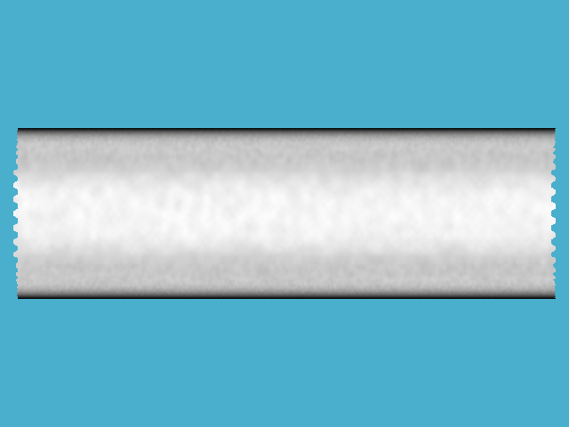

CharLES Helmholtz solver + Boussinesq approximation 
(scalar transport equation)
----
- The objective is to check validity of using Helmholtz solver with scalar transport equation instead of ideal-gas solver, which solves for full temperature field (more expensive). 
- Boussinesq approximation is used to include momentum 
- First step is the validation of original solver (without buoyancy force), and the second step includes buoyancy effect

**Comments**

- Pressure and temperature coupling (their fluctuation)

## 1. Original solver + wall boundary condition for scalar

**validation case: [turbulent channel flow](channel_flow/)**

- Turbulent channel flow (*Retau* =395)
- Constant temperature (scalar at upper and lower walls)
- No buoyancy effect

 

Figure: development of streamwise velocity & scalar field

## 2. Add momentum source term (Boussinesq approximation)

**Test case to check code works: [Rayleigh-Benard convection](Rayleigh-Benard/)**

- Rayleigh-Benard convection: higher temperature at the bottom and lower temperature at the top boundary
- Instability occurs by temperature gradient in reverse to the gravity

Figure: scalar field

**Validation case: [thermally-driven cavity](cavity/)**

- Cavity flow driven by buoyancy force (temperature difference between walls)
- Run cases in different Rayleigh number (104, 105, 106)

Figure: velocity and temperature fields, Ra=106

**Validation case: [Vertical turbulent channel flow](vertical_channel/)**

- Vertical channel frow driven by gravitational force (buoyancy) (temperature difference between walls)
- Run different Rayleigh numbers (Reference results available: DNS case)

Figure: temperature field, Ra=5.4x105

