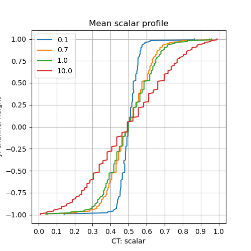

# CharLES Helmholtz solver + Boussinesq approximation (scalar tarnsport equation)

### 0. original solver + wall boundary condition for scalar
##### validation case: 

Q. Check governing equation?

1. Schmidt number should go denominator (divided)? \
-> Varying trend of mean scalar profiles is the opposite to as it should be.

    
-> Add results using updated code

### 1. Add momentum source term (using Boussinesq approximation)
##### Test case to check code works: 

##### Validation case: 
$$\Psi \rangle $$
### Comments
1. Pressure and temperature coupling (their fluctuation)
2. 
  
