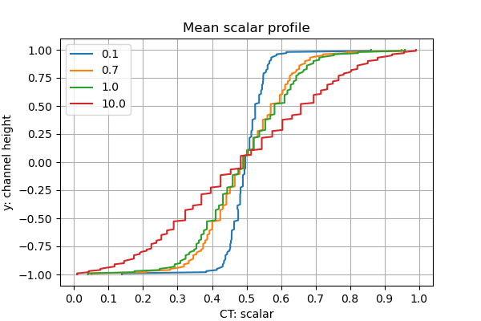
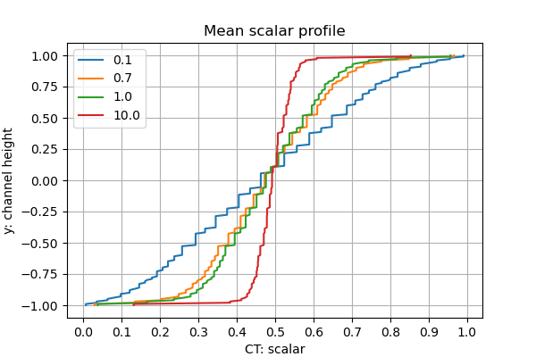

CharLES Helmholtz solver + Boussinesq approximation 
(scalar transport equation)
----
- The objective is to check validity of using Helmholtz solver with scalar transport equation instead of ideal-gas solver, which solves for full temperature field (more expensive). 
- Boussinesq approximation is used to include momentum 
- First step is the validation of original solver (without buoyancy force), and the second step includes buoyancy effect

**Comments**
- Pressure and temperature coupling (their fluctuation)

## 1. Original solver + wall boundary condition for scalar

**validation case: [turbulent channel flow](channel_flow/)**
Reference: 
1. Paper & data
2. Cascade webpage

Result using origial code:

- Varying trend of mean scalar profiles is the opposite to as it should be \
-> Schmidt number should go denominator instead of numerator? 

Results using updated code:

Modified codes:
1. **HelmholtzSolver.cpp & HelmholtzSolverBCs.cpp**
    Modify scalar transport equation part, \
    Schmidt number is divided instead of being multiplied     
2. **FlowSolver.hpp**
    Initial value of Schmidt number is set to 1.0 (originally 0.0),\
    to avoid errors due to zero division

## 2. Add momentum source term (Boussinesq approximation)
**Test case to check code works: [Rayleigh-Benard convection](Rayleigh-Benard/)**
- Rayleigh-Benard convection: higher temperature at the bottom and lower temperature at the top boundary
- Instability occurs by temperature gradient in reverse to the gravity

**Validation case: [thermally-driven cavity](cavity/)**
1) Cavity flow driven by buoyancy force (temperature difference between walls)
2) Run cases in different Rayleigh number (104, 105, 106)

