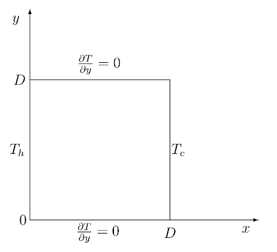
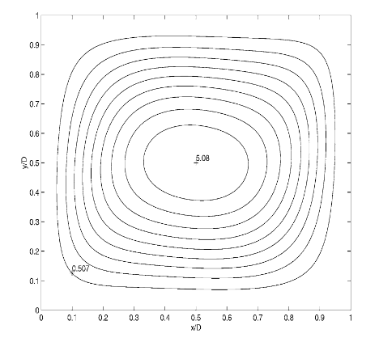
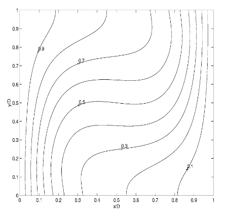
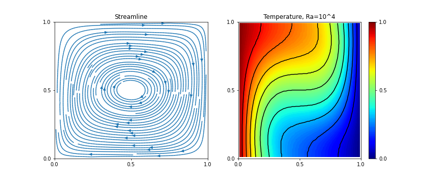
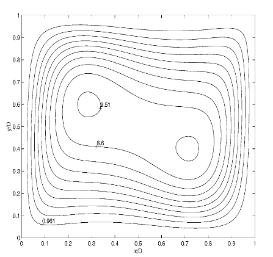
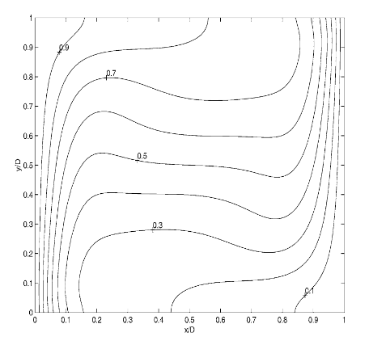
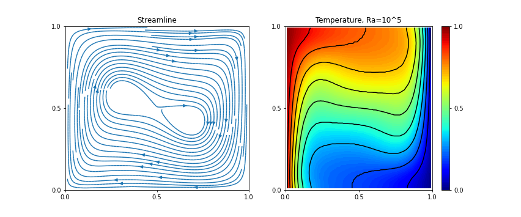
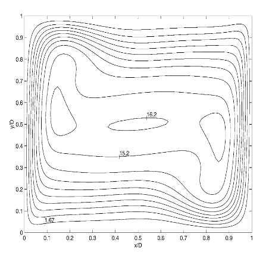
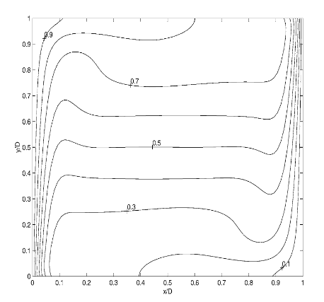
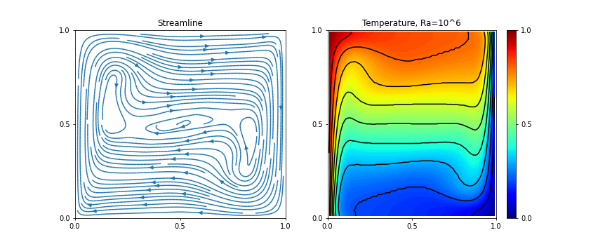

# Thermally driven cavity

**Reference**: [Rubio, et al. "Thermally driven cavity flow with Neumann condition for the pressure"](https://doi.org/10.1016/S0168-9274(01)00083-6)

## Setup

1) Boussinesq approximation
2) Fixed Prandtl number(*Pr*=0.71,fixed) \
(Schmidt number (*Sc*) for scalar transport)
3) Raleigh number (*Ra* = (104, 105, and 106)

## Result

Comparison of steady temperature field
1) _Ra_=104

2) _Ra_=105

3) _Ra_=106

## Time evolution of temperature field

