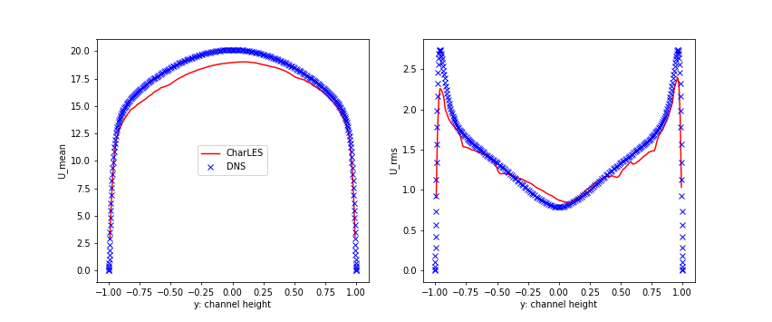

# Turbulent channel flow

**References**

1. [DNS data (for flow field)](https://turbulence.oden.utexas.edu/data/MKM/chan395/profiles/)
2. [Cascade webpage (using ideal gas solver)](https://support.cascadetechnologies.com/posts/1968-turbulent-channel)
3. Mean scalar profiles from (Re_tau = 180): [Dong, et al "An investigation of the Prandtl number effect on turbulent heat transfer in channel flows by large eddy simulation"](https://link.springer.com/article/10.1007/BF01171446)

---

### Comparison to other simulation results

- Velocity profiles \
  comparison to DNS data (Re_tau = 395 for both)

  

  

  
Figure. comparison of velocity profiles

  

- Scalar field \
  : Re tau = 180 for reference data

Figure. reference profile [3] 

Figure. CharLES result 

---

### Minor correction in source code 

- Varying trend of mean scalar profiles is the opposite to as it should be \
  -> Schmidt number should go denominator instead of numerator? 

- Modified codes

  1. **HelmholtzSolver.cpp & HelmholtzSolverBCs.cpp**
     Modify scalar transport equation part, \
     Schmidt number is divided instead of being multiplied     

  2. **FlowSolver.hpp**
     Initial value of Schmidt number is set to 1.0 (originally 0.0) to avoid errors due to zero division

     

- Results

 Figure: result using origial code 

 Figure: result using updated code 

