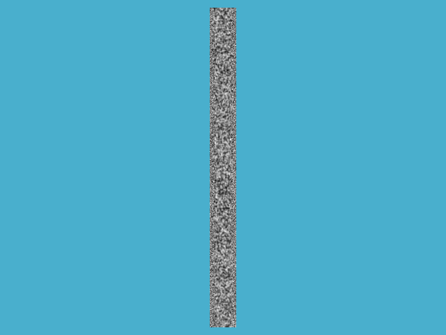
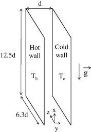
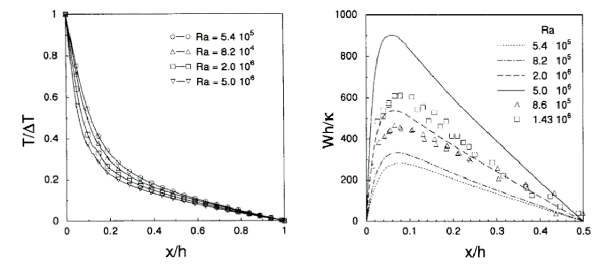
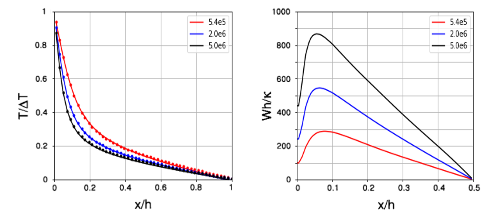
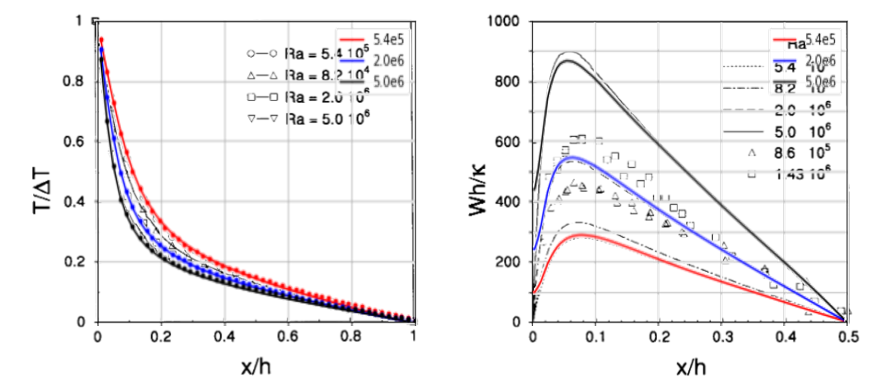

# Vertical channel flow
---

## References: 

- [1. Pallares, J., et al. "Turbulent large-scale structures in natural convection vertical channel flow." *International journal of heat and mass transfer* 53.19-20 (2010): 4168-4175.](https://www.sciencedirect.com/science/article/pii/S0017931010002814)
- [2. Versteegh, T. A. M., and F. T. M. Nieuwstadt. "Turbulent budgets of natural convection in an infinite, differentially heated, vertical channel." *International Journal of Heat and Fluid Flow* 19.2 (1998): 135-149.](https://reader.elsevier.com/reader/sd/pii/S0142727X97100182?token=9E46E482032F07B97CB7E706680985FA9FA6A32B4F90EEFEED92BD2622FEA123E147D1D00E48BB1C503B633DA1E464D9)
- [3. Versteegh, T. A. M., and F. T. M. Nieuwstadt. "A direct numerical simulation of natural convection between two infinite vertical differentially heated walls scaling laws and wall functions." *International Journal of Heat and Mass Transfer* 42.19 (1999): 3673-3693.](https://reader.elsevier.com/reader/sd/pii/S001793109900037X?token=1255F157B1237FF80BE72E1969979A48363BC5ED7068B130E09134E6B2F3E8150DEE222C3DC0C890311987C23F5A0A72)
---

## Velocity and temperature fields

**Rayleigh number = 5.4 x 105**

  

**Rayleigh number = 2.0 x 106**

  

**Rayleigh number = 5.0 x 106**

  

---

## Problem setup

Figure. setup of vertical channel flow simulation

- Domain (d x 12d x 6d, d: channel height), periodic in Y & Z directions -> profiles depend on domain size
- \# cells: 12.0M (coarse), 53.2M (fine)
- Prandtl number,\
 
- Rayleigh number,\
 

| Ra                   | g    | beta   | TH-TL | d (h) | nu                       |
| -------------------- | ---- | ------ | --------------------------- | ----- | ------------------------ |
| 5.4 x 105 | 10   | 0.0034 | 1                           | 1     | 2.114 x 10 -4 |
| 2.0 x 106 | 10   | 0.0034 | 1                           | 1     | 1.099 x 10 -4 |
| 5.0 x 106 | 10   | 0.0034 | 1                           | 1     | 6.948 x 10 -5 |

---

## Results

**Reference results using DNS**: [3] Versteegh, T. A. M., and F. T. M. Nieuwstadt.

Figure. DNS data of mean temperature and velocity profiles using different Rayleigh numbers 

**CharLES results**

Figure. CharLES

**Validation (comparison)**

Figure. comparison between DNS data and the results using CharLES

