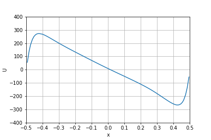
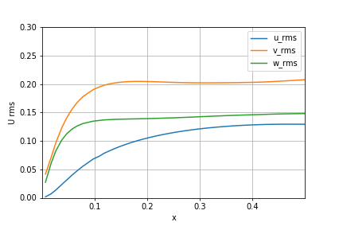

# Vertical channel flow
---
Reference:
- [1. Pallares, J., et al. "Turbulent large-scale structures in natural convection vertical channel flow." *International journal of heat and mass transfer* 53.19-20 (2010): 4168-4175.](https://www.sciencedirect.com/science/article/pii/S0017931010002814)
- [2. Versteegh, T. A. M., and F. T. M. Nieuwstadt. "Turbulent budgets of natural convection in an infinite, differentially heated, vertical channel." *International Journal of Heat and Fluid Flow* 19.2 (1998): 135-149.](https://reader.elsevier.com/reader/sd/pii/S0142727X97100182?token=9E46E482032F07B97CB7E706680985FA9FA6A32B4F90EEFEED92BD2622FEA123E147D1D00E48BB1C503B633DA1E464D9)
- [3. Versteegh, T. A. M., and F. T. M. Nieuwstadt. "A direct numerical simulation of natural convection between two infinite vertical differentially heated walls scaling laws and wall functions." *International Journal of Heat and Mass Transfer* 42.19 (1999): 3673-3693.](https://reader.elsevier.com/reader/sd/pii/S001793109900037X?token=1255F157B1237FF80BE72E1969979A48363BC5ED7068B130E09134E6B2F3E8150DEE222C3DC0C890311987C23F5A0A72)
---

  

Figure. velocity(left) and temperature(right) contours 

## Problem setup

- Prandtl number= 0.71
- Rayleigh number = 5.4e5
- Domain (d x 12d x 6d, d: channel height), periodic in Y & Z directions
- \# cells: 13.3M

Figure. setup of the vertical channel

## Results

**reference results using DNS**: Pallares, et al.[1]

Figure. Time averaged (a) velocity and (b) temperature profiles. (c) Reynolds stresses.

**CharLES results**

Figure. Time averaged velocity

Figure. Time averaged temperature profiles

Figure. Time averaged Reynolds stresses.
